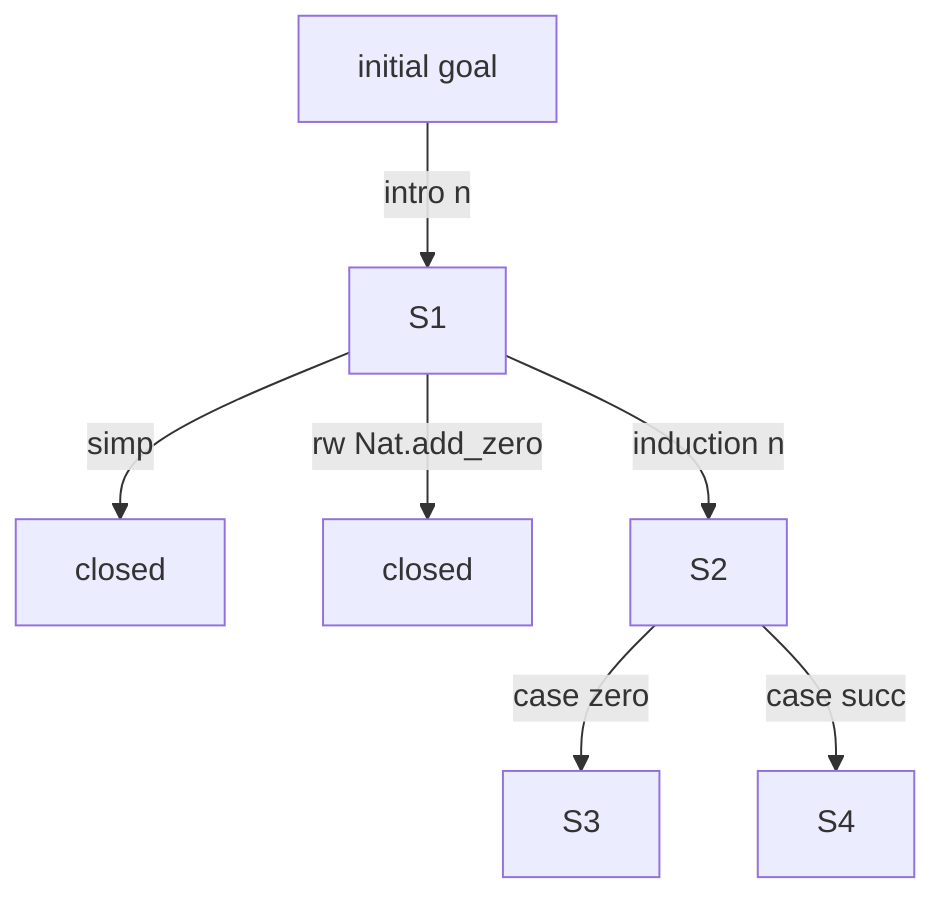

This document calls the new Lean-like system **NPA: Neuro-symbolic Proof Assistant**.
The goal is not merely to reimplement Lean, but to build a certificate-first
dependent-type proof assistant designed from the beginning for the AI era.

The most important lesson from Lean and Rocq is the separation between
convenient but untrusted layers and a small trusted kernel. Tactics, elaborators,
AI, and plugins are not trusted; the final proof term or proof object is checked
by a small kernel. The Lean reference describes Lean's core type theory as being
implemented in a minimal kernel that checks proof terms, while tactics generate
terms for that kernel to check. Rocq follows the same de Bruijn criterion by
separating kernel checking from elaboration and tactics. ([Lean Language][1])

---

# 1. Desired Final System

The target is not a standalone prover, but an integrated system.

```text
NPA = logical kernel
    + surface language
    + elaborator
    + tactic language
    + automated prover
    + AI proof-search substrate
    + mathematics library
    + package management
    + proof certificate format
    + independent checker
    + sandbox verification substrate
    + IDE / API
```

In one sentence:

```text
A certificate-first proof assistant where AI searches for proofs,
humans confirm formalization intent,
and the kernel plus independent checkers inspect only proof certificates.
```

---

# 2. Overall Architecture

The system is split into nine layers.

```text
┌──────────────────────────────────────────────┐
│ 9. User / IDE / Web UI / API                  │
│    editor, goal display, AI assistance, proof │
│    explanation                                │
├──────────────────────────────────────────────┤
│ 8. AI Proof Orchestrator                      │
│    LLM, RAG, search, repair, lemma proposal   │
├──────────────────────────────────────────────┤
│ 7. Automation / Solvers                       │
│    simp, ring, omega, linarith, SMT, ATP      │
├──────────────────────────────────────────────┤
│ 6. Tactic / Metaprogramming                   │
│    intro, apply, rw, induction, custom tactic │
├──────────────────────────────────────────────┤
│ 5. Elaborator / Surface Language              │
│    notation, implicit args, typeclass, holes  │
├──────────────────────────────────────────────┤
│ 4. Core Language                              │
│    explicit dependent terms, defs, theorems,  │
│    inductive types                            │
├──────────────────────────────────────────────┤
│ 3. Proof Certificate Format                   │
│    canonical AST, universe constraints, hash  │
├──────────────────────────────────────────────┤
│ 2. Trusted Kernel                             │
│    type checking, reduction, inductive checks,│
│    proof checks                               │
├──────────────────────────────────────────────┤
│ 1. Independent Checkers / Audit Layer         │
│    alternate checker implementations,         │
│    out-of-sandbox checks, CI audit            │
└──────────────────────────────────────────────┘
```

Higher layers are more convenient and less trusted. Lower layers are smaller,
easier to audit, and trusted.

---

# 3. Design Principles

## 3.1 AI Must Never Enter the Trusted Base

AI may:

```text
- propose formalizations
- search for useful lemmas
- propose tactics
- suggest intermediate lemmas
- read errors and propose repairs
- shorten proofs
- write human-facing explanations
```

Every AI output is unverified.

```text
AI output
  ↓
tactic / elaborator
  ↓
core proof term
  ↓
kernel / certificate check
  ↓
verified (normal mode)
  ↓
independent checker(s)
  ↓
verified_high_trust
```

This is the target high-trust flow. It does not mean the current repository may
generate a `verified_high_trust` artifact from reference-checker-only evidence,
or that the external checker is required in PR mode.

This boundary does not change when automation or Machine APIs live in
`crates/npa-api`. That crate may provide proof-search controllers, checker audit
automation, and advanced automation endpoints, but those are producer /
orchestrator / validator-facing libraries, not trusted checkers. Replay plans,
sidecars, audit summaries, and fixture results generated by `npa-api` are not
evidence for proof acceptance until the canonical certificate and deterministic
kernel / independent-checker results recheck them.

## 3.2 Center the System on Proof Certificates, Not Proof Scripts

In Lean and Rocq, users write proof scripts, but correctness ultimately comes
from proof terms / proof objects. NPA makes **proof certificates** first-class
from the beginning.

```json
{
  "format": "NPA-CERT-0.1",
  "core_spec": "NPA-Core-0.1",
  "module": "Algebra.Group.Basic",
  "imports": [
    {
      "module": "Algebra.Group.Defs",
      "export_hash": "sha256:...",
      "certificate_hash": "sha256:..."
    }
  ],
  "declarations": [
    {
      "kind": "theorem",
      "name": "Group.mul_inv_cancel",
      "decl_interface_hash": "sha256:...",
      "decl_certificate_hash": "sha256:...",
      "axioms_used": []
    }
  ],
  "export_block": [
    {
      "name": "Group.mul_inv_cancel",
      "decl_interface_hash": "sha256:..."
    }
  ],
  "axiom_report": {
    "module_axioms": [],
    "per_declaration": []
  },
  "hashes": {
    "export_hash": "sha256:...",
    "certificate_hash": "sha256:...",
    "axiom_report_hash": "sha256:..."
  }
}
```

Metadata such as `source_script`, `kernel_version`, or `checked_by` may be
attached in a separate audit view, but it is not part of the canonical payload
or certificate hash. Proof scripts are regenerable explanations; certificates
are the artifact of record.

## 3.3 Small Kernel, Strong Surrounding Layers

Kernel responsibilities:

```text
- type checking for core terms
- definition unfolding
- definitional equality
- universe constraint checking
- inductive type validity checking
- recursor / eliminator generation or validation
- logical checking of decoded canonical module certificates
```

Not kernel responsibilities:

```text
- tactic execution
- AI calls
- theorem search
- typeclass search
- notation interpretation
- SMT execution
- file I/O
- network
- plugin loading
- package resolution
```

The Rocq documentation likewise explains that separating tactics and elaboration
from the kernel keeps the trusted part limited to a small kernel. ([Rocq][2])

---

# 4. Logical System

For a new system, the foundation should be conservative: a CIC-like dependent
type theory close to Lean/Rocq.

## 4.1 Sort

```text
Prop      : world of proof propositions
Type 0    : world of small data types
Type 1
Type 2
...
```

Recommended:

```text
- proof irrelevance for Prop is a theorem / optional axiom if needed
- Type hierarchy is predicative
- universe polymorphism exists
- v0.1 uses `imax` for impredicative Prop
```

v0.1 definitional equality does not include proof irrelevance conversion. This
matches the Phase 0 / core-spec policy and keeps the kernel conversion checker
small.

`Prop` and `Type` are separated to distinguish proofs from computational data.

```text
p : Prop
h1 h2 : p
```

As proofs, `h1` and `h2` need not be distinguished. But for:

```text
x y : Nat
```

the distinction between `x` and `y` is computationally important.

## 4.2 Core Term

The core language is explicit and has no notation or omitted arguments.

```text
Term ::=
  Sort Level
| BVar Index
| Const Name [Level]
| App Term Term
| Lam Name Type Body
| Pi  Name Type Body
| Let Name Type Value Body
```

`Nat`, `Eq`, `List`, constructors, and recursors are not special core syntax.
They are referenced as `Const` values registered in the environment.
Source-level `match` elaborates to recursor application and does not remain in
core terms.

Core terms must not contain:

```text
- notation
- implicit arguments
- typeclass placeholders
- unresolved metavariables
- overloaded symbols
- user syntax macro
- AI annotation
```

The kernel checks only fully explicit terms.

## 4.3 Definitional Equality

Definitional equality is one of the hardest parts of a proof assistant.

Required reductions:

```text
β-reduction:
  (fun x => t) a  ↦  t[x := a]

δ-reduction:
  unfold defined constants

ι-reduction:
  computation rules for recursor applications

ζ-reduction:
  let x := a in t  ↦  t[x := a]

η-reduction:
  not included in v0.1; if added later, restrict it carefully
```

Policy:

```text
- the kernel conversion checker is deterministic
- reduction should be designed to terminate without fuel limits
- general recursion is not in core
- v0.1 recursive definitions elaborate to recursor applications
- general recursive definitions may be accepted later with termination certificates
- opacity / transparency is explicit
```

## 4.4 Inductive Types

Minimum v0.1 kernel targets:

```text
Nat
Eq
```

Early standard-library candidates:

```text
Bool
Unit
Empty
Prod
Sigma
Sum
List
```

Post-MVP:

```text
- mutual inductive
- nested inductive
- indexed inductive
- quotient
- coinductive
```

The kernel checks:

```text
- strict positivity
- universe consistency
- constructor types
- validity of eliminator generation
- recursion/induction principle
```

## 4.5 Recursion and Termination

General recursion in core breaks the logic. Therefore:

```text
- the source language may let users write recursive functions
- the elaborator requires termination evidence
- v0.1 passes recursor applications to the kernel
- well-founded recursion / termination certificates are future extensions
```

Example:

```text
def add : Nat → Nat → Nat
```

may be written naturally in source:

```lean
add zero     m = m
add (succ n) m = succ (add n m)
```

but core uses the Nat recursor.

---

# 5. Proof Certificate Format

## 5.1 Why Certificates Are Needed

Source proof scripts alone are insufficient.

```text
- parser or notation changes can change meaning
- elaborator bugs may produce the wrong term
- tactics may behave differently in future versions
- AI-generated proofs may contain malicious code
- build-environment dependence hurts reproducibility
```

Lean's proof-validation documentation also discusses the need to check whether
formal statements match intent, imported libraries are trusted, `sorry` or
custom axioms appear, and high-trust validation needs sandboxes and external
checkers. ([Lean Language][3])

## 5.2 Certificate Structure

```text
TrustedCertificatePayload =
  Header
  Imports
  NameTable
  LevelTable
  TermDAG
  Declarations
  ExportBlock
  AxiomReport
  Hashes(export_hash, certificate_hash, axiom_report_hash)

CertificateFile =
  TrustedCertificatePayload
  SourceMap (non-trusted metadata)
```

`SourceMap` and display metadata may be attached to the file, but they are not
part of canonical payloads or hash inputs.

Declaration shape:

```json
{
  "kind": "theorem",
  "name": "Nat.add_zero",
  "universes": [],
  "type": {
    "core": "Pi n : Nat, Eq Nat (add n zero) n",
    "hash": "sha256:..."
  },
  "proof": {
    "core": "Nat.rec ...",
    "hash": "sha256:..."
  },
  "opaque": true,
  "dependencies": ["Nat.rec", "Eq.refl"],
  "axioms_used": [],
  "decl_interface_hash": "sha256:...",
  "decl_certificate_hash": "sha256:..."
}
```

## 5.3 Certificates Must Be Canonical

The same canonical payload must produce the same hash.

```text
- use de Bruijn indices
- keep names for debugging only
- no whitespace sensitivity
- no notation
- no implicit arguments
- normalize universe constraints
- fix dependency order
- record transparent/opaque status explicitly
```

## 5.4 Compressed Certificates

Large libraries produce large proof terms, so compression is necessary.

Possible techniques:

```text
- subterm sharing
- hash-consing
- local abbreviations
- sharing / abbreviated representation of Prop proofs
- macro-style compression for repeated tactic patterns
```

If compressed representation is stored in the certificate, the trusted payload
must follow one of these approaches:

```text
safe approach A:
  store only expanded terms in the canonical payload

safe approach B:
  put a separately verified compression-expansion checker inside the trusted boundary
```

The MVP uses A. Compression that assumes proof irrelevance as a conversion rule
is not used in v0.1. If used later, it must appear as a standard-library theorem
or explicit axiom and be reported in the axiom report.

---

# 6. Kernel Design

## 6.1 Kernel API

The kernel API is intentionally small.

```rust
check_module(module: CanonicalModuleCert, imports: VerifiedImports) -> CheckResult
check_decl(env: Environment, decl: Declaration) -> CheckResult
infer_type(env: Environment, term: Term) -> Type
is_defeq(env: Environment, t: Term, u: Term) -> Bool
check_inductive(env: Environment, ind: InductiveDecl) -> CheckResult
```

`CanonicalModuleCert` is structured data already decoded and ready for
canonicality checks, not a result of kernel file I/O or network fetching.
Reading files, resolving the import store, and canonical binary decode belong to
the checker / loader. The kernel API is side-effect free. `VerifiedImports` is a
decoded import environment prepared by the checker / loader.

## 6.2 Kernel Internals

```text
Environment
  ├── constants
  ├── inductives
  ├── universe constraints
  ├── transparency table
  └── trusted primitives

Context
  ├── local variables
  ├── local definitions
  └── universe parameters

Reduction Engine
  ├── whnf
  ├── unfold
  ├── reduce_recursors
  └── normalize_for_conversion

Type Checker
  ├── infer
  ├── check
  ├── conversion
  └── universe solver
```

## 6.3 At Least Two Checker Implementations

Design for multiple checkers from the beginning.

```text
npa-kernel-fast:
  Rust implementation for normal development.

npa-checker-ref:
  small readable reference implementation; slow is acceptable.

npa-checker-verified:
  future candidate verified in NPA itself, Rocq, Lean, or another system.
```

Lean documentation also describes high-trust validation through proof rechecking
tools such as `lean4checker` and external checkers. For malicious or AI-generated
proofs, the recommended direction is to build in a sandbox and check exported
proofs outside the sandbox. ([Lean Language][3])

---

# 7. Surface Language

The user-facing language is much more convenient than core.

## 7.1 Surface Syntax

```npa
theorem add_zero (n : Nat) : n + 0 = n := by
  induction n with
  | zero => refl
  | succ n ih => simp [add, ih]
```

Surface examples in this document sometimes use `0` for readability. For the
Phase 3 MVP input, writing `Nat.zero` or `zero` in an opened namespace is enough
until numeric literals exist. The certificate stores the canonical `Const`
reference to `Nat.zero`.

Surface language features:

```text
- notation
- implicit arguments
- named arguments
- coercion
- typeclass
- pattern matching
- do notation
- calc block
- holes
- tactic block
- namespace
- inductive declaration
- sections
- attributes
```

## 7.2 Elaborator

The elaborator performs:

```text
source term
  ↓
parse
  ↓
name resolution
  ↓
notation expansion
  ↓
implicit argument insertion
  ↓
typeclass search
  ↓
metavariable solving
  ↓
termination checking
  ↓
core term generation
```

Its output must be inspectable.

```text
#print surface theorem_name
#print core theorem_name
#print certificate theorem_name
#print axioms theorem_name
#print dependencies theorem_name
```

## 7.3 The Elaborator Is Not Trusted

If the elaborator has a bug, the kernel still checks the core term. However, the
elaborator may translate the user's input into a statement the user did not
intend. The kernel cannot prevent that.

Therefore ambiguous notation and natural language must include back-translation
and confirmation.

```text
user input:
  for every positive number x, x^2 > 0

formalization candidate:
  ∀ x : ℝ, 0 < x → 0 < x ^ 2

back-translation:
  For every real number x, if x is greater than 0, then x^2 is greater than 0.
```

---

# 8. Tactic / Metaprogramming

Lean describes tactics as imperative programs that transform proof states:
success returns new subgoals, and zero subgoals means the proof is complete.
Tactics construct proof terms in the background, and those terms are checked by
the kernel. ([Lean Language][4])

NPA follows that model, but makes it more structured for AI.

## 8.1 Proof State

Use structured data, not only strings.

```json
{
  "state_id": "s_9f32",
  "goals": [
    {
      "goal_id": "g1",
      "context": [
        {
          "name": "n",
          "type_surface": "Nat",
          "type_core_hash": "sha256:..."
        },
        {
          "name": "ih",
          "type_surface": "n + 0 = n",
          "type_core_hash": "sha256:..."
        }
      ],
      "target_surface": "Nat.succ n + 0 = Nat.succ n",
      "target_core_hash": "sha256:...",
      "suggested_actions": ["simp", "rw [ih]", "exact congrArg Nat.succ ih"]
    }
  ]
}
```

## 8.2 Tactic API

```json
{
  "state_id": "s_9f32",
  "tactic": "simp [Nat.add_zero]"
}
```

Result:

```json
{
  "status": "success",
  "new_state_id": "s_a18c",
  "closed_goals": ["g1"],
  "new_goals": [],
  "certificate_delta_hash": "sha256:...",
  "messages": []
}
```

Failure:

```json
{
  "status": "error",
  "error_kind": "rewrite_failed",
  "message": "rewrite rule Nat.add_zero does not match target",
  "expected_pattern": "?x + 0",
  "target": "0 + n = n",
  "repair_hints": [
    "try `simp`",
    "try `rw [Nat.zero_add]`"
  ]
}
```

## 8.3 Tactic Categories

```text
Pure tactic:
  reads only proof state and returns a proof-term fragment.
  safe by default.

Search tactic:
  queries the theorem database.
  timeout required.

Solver tactic:
  uses an external solver or internal decision procedure.
  certificate required.

AI tactic:
  calls an LLM or model.
  sandbox + kernel check required.

Effectful tactic:
  touches files, network, or external processes.
  explicit capability permission required.
```

## 8.4 Capability Model

Tactics and plugins declare capabilities.

```text
cap.read_environment
cap.search_library
cap.call_solver
cap.call_ai
cap.read_file
cap.write_file
cap.network
cap.spawn_process
```

Defaults:

```text
- read_environment is allowed
- search_library is allowed
- call_solver is restricted
- call_ai is restricted
- file/network/process are forbidden
```

Rocq documentation explains that plugins can change Rocq behavior in unexpected
ways and require higher trust than ordinary libraries; tools such as `rocqchk`
mitigate this. NPA avoids the problem by making plugins capability-controlled
and unable to modify the kernel. ([Rocq][5])

---

# 9. Automation Engine

NPA automation is not just a pile of tactics. It is a set of
**proof-producing solvers**.

## 9.1 Standard Tactics

Initial tactics:

```text
intro
exact
apply
refine
constructor
cases
induction
rw
simp
simp_all
assumption
contradiction
exists
specialize
have
calc
```

## 9.2 Decision Procedures

Provide proof-producing solvers by domain.

```text
arithmetic:
  omega / presburger
  linarith
  nlinarith
  norm_num

algebra:
  ring
  group
  field_simp

propositional logic:
  tauto
  aesop-style search
  SAT certificate

equality:
  congruence closure
  e-graph rewrite
```

A solver answer is not enough.

```text
solver says:
  goal is true

not sufficient.

solver returns:
  certificate C

kernel/checker verifies:
  C proves goal
```

## 9.3 `simp` Design

`simp` is central to practical use.

Metadata for `simp`:

```json
{
  "theorem": "Nat.add_zero",
  "orientation": "left_to_right",
  "priority": 1000,
  "safe": true,
  "terminating": true,
  "tags": ["arithmetic", "nat", "zero"]
}
```

Execution result:

```json
{
  "rewrites": [
    {
      "lemma": "Nat.add_zero",
      "position": "target.left",
      "before": "n + 0",
      "after": "n"
    }
  ],
  "certificate_delta": "..."
}
```

This log should also be available to AI.

---

# 10. AI Proof-Search Layer

This is the distinguishing part of NPA.

LeanDojo-v2 is a framework for training, evaluating, and deploying
AI-assisted theorem provers for Lean 4. It combines repository tracing, proof
state extraction, RAG, fine-tuning, external inference APIs, and sequential
proof search. NPA treats this as standard system functionality rather than an
external framework. ([Leandojo][6])

## 10.1 AI Layer Components

```text
AI Orchestrator
  ├── Formalizer
  │     natural language / LaTeX → formal statement candidates
  │
  ├── Premise Retriever
  │     search theorems relevant to the current goal
  │
  ├── Tactic Policy Model
  │     generate next tactic candidates
  │
  ├── Value Model
  │     estimate whether this proof state is solvable
  │
  ├── Repair Model
  │     generate repairs from errors
  │
  ├── Lemma Proposer
  │     propose intermediate lemmas
  │
  ├── Proof Minimizer
  │     shorten completed proofs
  │
  └── Explanation Model
        explain verified proofs to humans
```

## 10.2 Search Tree

AI should build a search tree, not emit one proof.

```text
node = proof state
edge = tactic
terminal = goals = []
```



Search sketch:

```python
def prove(goal, budget):
    s0 = init_state(goal)
    queue = PriorityQueue()
    queue.push(s0, proof=[], priority=0)

    visited = set()

    while queue and not budget.exceeded():
        state, proof = queue.pop()

        if state.hash in visited:
            continue
        visited.add(state.hash)

        premises = retrieve_premises(state)
        tactic_candidates = generate_tactics(state, premises)
        tactic_candidates += deterministic_tactics(state)
        tactic_candidates = rank(state, tactic_candidates)

        for tac in tactic_candidates:
            result = run_tactic(state, tac)

            if result.success:
                new_proof = proof + [tac]

                if result.closed:
                    cert = assemble_certificate(new_proof)
                    if kernel_check(cert) and independent_check(cert):
                        return VerifiedProof(cert, new_proof)

                queue.push(result.new_state, new_proof, score(result))

            else:
                repairs = repair_tactic(state, tac, result.error)
                queue.push_many(state, proof, repairs)

    return Failure(best_partial=queue.best())
```

## 10.3 Score Function

```text
score =
  + tactic_policy_score
  + value_model_score
  + premise_match_score
  + goal_simplification_score
  + novelty_bonus
  - proof_length_penalty
  - repeated_state_penalty
  - expensive_tactic_penalty
  - timeout_risk_penalty
```

## 10.4 Input to AI

Pass structured data, not just text.

```json
{
  "goal": {
    "context": [
      {"name": "n", "type": "Nat"},
      {"name": "ih", "type": "n + 0 = n"}
    ],
    "target": "Nat.succ n + 0 = Nat.succ n"
  },
  "nearby_premises": [
    {
      "name": "Nat.add_zero",
      "type": "∀ n : Nat, n + 0 = n",
      "match_score": 0.98
    },
    {
      "name": "congrArg",
      "type": "..."
    }
  ],
  "failed_tactics": [
    {
      "tactic": "rw [Nat.add_zero]",
      "error": "rewrite rule did not match"
    }
  ],
  "allowed_tactics": [
    "simp",
    "rw",
    "exact",
    "apply",
    "induction"
  ]
}
```

AI output:

```json
{
  "candidates": [
    {
      "tactic": "simp [Nat.add_zero]",
      "confidence": 0.93,
      "reason": "target contains addition by zero"
    },
    {
      "tactic": "exact congrArg Nat.succ ih",
      "confidence": 0.75,
      "reason": "induction hypothesis proves inner equality"
    }
  ]
}
```

## 10.5 AI Prohibitions

AI cannot directly:

```text
- register a theorem as verified
- add an axiom
- modify the kernel
- save an unchecked certificate
- read files outside the sandbox
- change the package lock
- rewrite trusted libraries
```

---

# 11. Premise Search / RAG

Choosing the right lemma is often the hard part of mathematics. NPA makes
theorem search standard functionality.

## 11.1 Theorem Database

Each theorem stores:

```json
{
  "name": "Nat.add_zero",
  "namespace": "Nat",
  "statement_surface": "∀ n : Nat, n + 0 = n",
  "statement_core_hash": "sha256:...",
  "domain_tags": ["arithmetic", "nat"],
  "attributes": ["simp"],
  "rewrite": {
    "lhs": "?n + 0",
    "rhs": "?n",
    "orientation": "left_to_right"
  },
  "dependencies": ["Nat.rec", "Eq.refl"],
  "used_by_count": 1823,
  "proof_length": 12,
  "embedding_id": "emb_...",
  "examples": [
    "simp",
    "rw [Nat.add_zero]"
  ]
}
```

## 11.2 Four Search Stages

```text
1. lexical search
   name and string matching

2. semantic search
   embedding similarity

3. type-aware search
   can it be applied, rewritten, or simpa-used on the target?

4. graph-aware reranking
   prefer common lemmas and nearby dependency graph nodes
```

Example:

```text
goal:
  n + 0 = n

candidates:
  Nat.add_zero
  add_zero
  zero_add
  add_assoc
```

The type-aware filter ranks `Nat.add_zero` first.

## 11.3 Theorem Graph

Store the dependency graph of all theorems. Phases 6/7 use the minimal
dependency graph / theorem index derived from certificates. Phase 9 expands this
into a full theorem graph with schema, APIs, and ranking data.

```text
Nat.add_comm
  ├── Nat.add_assoc
  ├── Nat.add_zero
  └── Nat.zero_add
```

Uses:

```text
- premise selection
- proof minimization
- library refactoring
- theorem recommendation
- training data generation
- cycle detection
```

---

# 12. Library Design

The long-term value of a proof assistant is its library.

## 12.1 Library Structure

```text
Std
  ├── Logic
  ├── Data
  │   ├── Nat
  │   ├── Int
  │   ├── Rat
  │   ├── Real
  │   ├── List
  │   └── Finset
  ├── Algebra
  ├── Order
  ├── Topology
  ├── Analysis
  ├── Measure
  ├── Category
  ├── Computability
  └── Programming
```

## 12.2 Naming Rules

Names matter for both humans and AI search.

Good names:

```text
Nat.add_zero
Nat.zero_add
Nat.add_assoc
Nat.mul_comm
Group.mul_inv_cancel
Continuous.comp
Measurable.comp
```

Avoid:

```text
lemma1
foo
aux2
main_helper
```

## 12.3 Attributes

Theorems carry attributes.

```text
@[simp]
@[rewrite]
@[intro]
@[elim]
@[congr]
@[norm]
@[safe]
@[unsafe_for_simp]
```

Attributes are not decoration; they are core data for automation and AI search.

## 12.4 Library CI

CI checks:

```text
- kernel check
- independent checker check
- axiom report
- no sorry
- no unsafe meta-code in trusted modules
- naming lint
- doc lint
- simp termination lint
- dependency graph diff
- proof certificate hash diff
- performance regression
```

---

# 13. Package Management / Build

Lean's Lake is the standard build tool for Lean code, external dependencies,
Reservoir integration, tests, and linters. ([Lean Language][7])

NPA extends this idea for proof artifacts.

## 13.1 Package File

```toml
[package]
name = "algebra-basic"
version = "1.2.0"
kernel = ">=0.3,<0.4"

[dependencies]
std = "1.2.1"
order = "0.8.0"

[trust]
allow_axioms = ["Classical.choice", "Propext"]
deny_sorry = true
deny_custom_axioms = true
require_independent_checker = true

[build]
sandbox = true
network = false
timeout_seconds = 300
```

## 13.2 Lockfile

```json
{
  "package": "algebra-basic",
  "dependencies": [
    {
      "name": "std",
      "version": "1.2.1",
      "source": "registry",
      "content_hash": "sha256:..."
    }
  ],
  "kernel_version": "0.3.2",
  "certificate_format": "NPA-CERT-0.1",
  "checked_at": "2026-05-03T00:00:00Z"
}
```

## 13.3 Build Artifacts

Certificates are build artifacts, not just source.

```text
_build/
  module.npo        compiled object
  module.npcert     proof certificate
  module.graph.json minimal theorem dependency graph derived from certificate
  module.axioms.json derived axiom report view
  module.trace.json proof state trace
```

---

# 14. Security Design

Security is central when accepting AI-generated proofs and external packages.

## 14.1 Sandbox Build

Run all untrusted code in a sandbox.

```text
- no network
- read-only source directory
- limited temp directory
- CPU limit
- memory limit
- wall-clock limit
- process count limit
- syscall limit
```

## 14.2 Separate Trusted Challenge from Untrusted Proof

High-trust mode uses:

```text
trusted challenge file:
  theorem statement only

untrusted proof file:
  proof generated by AI or an external user

validator:
  build proof in sandbox
  export proof certificate
  check certificate outside sandbox
  confirm theorem statement matches the challenge
```

This follows the same direction as Lean's proof-validation documentation:
separate trusted challenge from possibly malicious proof, build in a sandbox,
and check with an external checker. ([Lean Language][3])

## 14.3 Audit Command

```text
#audit theorem_name
```

Output:

```json
{
  "theorem": "Nat.add_zero",
  "kernel_checked": true,
  "external_checked": true,
  "contains_sorry": false,
  "custom_axioms": [],
  "standard_axioms": [],
  "unsafe_meta_code": false,
  "imports": [
    {
      "module": "Std.Nat",
      "export_hash": "sha256:...",
      "certificate_hash": "sha256:..."
    }
  ],
  "certificate_hash": "sha256:..."
}
```

---

# 15. IDE / UI

UI matters for proof assistants.

## 15.1 IDE Display

```text
left: source code
upper right: current goals
middle right: local context
lower right: AI suggestions
bottom: messages / errors
```

Goal display:

```text
n : Nat
ih : n + 0 = n
⊢ Nat.succ n + 0 = Nat.succ n
```

AI suggestions:

```text
1. simp [Nat.add_zero]
   reason: target contains addition by zero.

2. exact congrArg Nat.succ ih
   reason: induction hypothesis proves n + 0 = n.

3. rw [Nat.add_zero]
   reason: rewrite by add_zero may close the goal.
```

## 15.2 Core Display

Users can always inspect:

```text
Show:
  - surface theorem
  - fully elaborated theorem
  - core theorem
  - proof certificate
  - used axioms
  - dependency graph
```

## 15.3 Education Mode

AI should not merely fill proofs; users should be able to learn.

Education mode:

```text
- suggests next tactics
- explains why they apply
- shows used lemmas
- gives natural-language proof explanations
- compares alternative proofs
```

---

# 16. External API Design

## 16.1 `/elaborate`

```json
{
  "source": "theorem add_zero (n : Nat) : n + 0 = n := by ?",
  "mode": "show_core"
}
```

Response:

```json
{
  "status": "ok",
  "surface_statement": "∀ n : Nat, n + 0 = n",
  "core_statement_hash": "sha256:...",
  "holes": [
    {
      "hole_id": "h1",
      "goal": {
        "context": [{"name": "n", "type": "Nat"}],
        "target": "n + 0 = n"
      }
    }
  ]
}
```

## 16.2 `/run_tactic`

```json
{
  "state_id": "s1",
  "tactic": "simp"
}
```

Response:

```json
{
  "status": "success",
  "closed": true,
  "new_state_id": "s2",
  "certificate_delta": "sha256:..."
}
```

## 16.3 `/prove`

```json
{
  "statement": "theorem add_zero (n : Nat) : n + 0 = n",
  "mode": "normal",
  "timeout_seconds": 60,
  "max_nodes": 10000,
  "allow_ai": true,
  "allow_external_solvers": true,
  "deny_sorry": true,
  "deny_custom_axioms": true
}
```

Response:

```json
{
  "status": "verified",
  "proof_script": "by simp",
  "certificate_hash": "sha256:...",
  "checked_by": ["npa-kernel-fast", "npa-checker-ref"],
  "axioms_used": [],
  "search_stats": {
    "nodes": 14,
    "failed_tactics": 8,
    "time_ms": 312
  }
}
```

## 16.4 `/search`

```json
{
  "goal": "n + 0 = n",
  "context": [{"name": "n", "type": "Nat"}],
  "limit": 10
}
```

Response:

```json
{
  "results": [
    {
      "name": "Nat.add_zero",
      "statement": "∀ n : Nat, n + 0 = n",
      "score": 0.99,
      "suggested_use": "simpa using Nat.add_zero n"
    }
  ]
}
```

---

# 17. Data Storage Design

## 17.1 Content-Addressed Store

Terms and certificates are managed by hash.

```text
TermStore
  hash -> core term

DeclStore
  name -> declaration hash

CertStore
  theorem -> certificate hash

TraceStore
  proof search trace
```

## 17.2 Proof Search Trace

Store both successes and failures for AI training.

```json
{
  "theorem": "Nat.add_zero",
  "states": [
    {
      "state_id": "s1",
      "goal": "n + 0 = n",
      "candidates": [
        {"tactic": "simp", "result": "success"},
        {"tactic": "rw [Nat.zero_add]", "result": "failure"}
      ]
    }
  ],
  "final_proof": "by simp",
  "certificate_hash": "sha256:..."
}
```

Failure logs are useful:

```text
- which tactic failed
- why it failed
- which repair worked
- which premise retrieval missed
```

This enables continuous model improvement.

---

# 18. Natural Language / LaTeX Support

Natural-language support is useful but dangerous. The kernel guarantees only
that a formalized proposition was proved.

## 18.1 Formalization Flow

```text
natural language / LaTeX
  ↓
multiple formalization candidates
  ↓
back-translation
  ↓
ambiguity display
  ↓
user confirmation
  ↓
proof search
```

Example:

```text
input:
  for every positive number x, x^2 > 0

candidate A:
  ∀ x : ℝ, 0 < x → 0 < x ^ 2

candidate B:
  ∀ x : ℚ, 0 < x → 0 < x ^ 2

candidate C:
  ∀ x : Nat, 0 < x → 0 < x ^ 2
```

UI display:

```text
The type of "positive number" is ambiguous in this statement.
Should it be interpreted as a real number ℝ?
```

## 18.2 Intent Certificate

Keep a record of natural-language intent separately from the formal proof.

```json
{
  "informal_statement": "for every positive number x, x^2 > 0",
  "formal_statement": "∀ x : ℝ, 0 < x → 0 < x ^ 2",
  "paraphrase": "For every real number x, if x is positive then x^2 is positive.",
  "confirmed_by_user": true,
  "confirmation_time": "..."
}
```

This is not a mathematical proof certificate, but it matters for audit.

---

# 19. High-Trust Mode

NPA separates normal mode from high-trust mode.

## 19.1 Normal Mode

```text
- source build
- kernel check
- axiom report
- no sorry check
```

## 19.2 High-Trust Mode

```text
- trusted challenge file
- sandbox build
- certificate export
- certificate validation outside sandbox
- recheck with multiple checkers
- theorem statement match
- import export_hash match, and certificate_hash match in high-trust mode
- axiom whitelist check
```

High-trust output:

```json
{
  "status": "verified_high_trust",
  "theorem_statement_match": true,
  "sandboxed_build": true,
  "kernel_checked": true,
  "external_checked": true,
  "checker_set": [
    "npa-kernel-rust",
    "npa-checker-ref",
    "npa-checker-ext"
  ],
  "axioms_used": [],
  "imports_verified": true
}
```

This JSON is the target artifact shape. To treat it as actual release evidence,
a built `npa-checker-ext` executable must be resolved through the runner-owned
registry / policy, and the required evidence must include the external checker
and high-trust reference result. Do not approximate `verified_high_trust` from
reference-only evidence.

---

# 20. Recommended Implementation Technologies

## 20.1 Kernel

Candidates:

```text
Rust:
  memory safety, performance, and independent-checker implementation fit.

OCaml:
  good fit with proof-assistant implementation culture.

Lean/Rocq:
  candidates for writing a verified checker.
```

Recommended:

```text
fast kernel:
  Rust

reference checker:
  small separate Rust implementation npa-checker-ref in the current repository.
  It may later be replaced with OCaml / Haskell.

external checker:
  OCaml clean-room npa-checker-ext.
  It must not depend on Rust workspace crates.

verified checker:
  later formally verified in NPA itself or Lean/Rocq.
```

## 20.2 Surface Language / Tactic

```text
Ideally written in NPA itself.
```

The Lean reference explains that Lean itself implements many components in Lean,
including tactics, elaborator, build tool, and language server. NPA should aim
to write most non-kernel layers in NPA itself. ([Lean Language][1])

## 20.3 AI Substrate

```text
Backend:
  Python / Rust / TypeScript

Search:
  Rust or Python

Vector DB:
  pgvector / Qdrant / Milvus

Graph:
  PostgreSQL recursive query or Neo4j

LLM:
  external API or local model

Checker:
  CPU worker pool

Proof search:
  Ray / Celery / custom actor system
```

---

# 21. Development Roadmap

## Phase 0: Specification

```text
- write the core calculus on paper
- typing rules
- conversion rules
- universe rules
- inductive rules
- certificate format
```

Deliverable:

```text
NPA Core Spec v0.1
```

## Phase 1: Small Kernel

Supports:

```text
- Sort
- Pi
- Lambda
- App
- Let
- Const
- Nat
- Eq
- simple inductive
- βδιζ reduction
```

Provable examples:

```text
∀ n : Nat, n = n
∀ n : Nat, n + 0 = n
```

## Phase 2: Certificate

```text
- canonical core AST
- module certificate
- import export_hash / certificate_hash
- declaration hash
- axiom report
```

## Phase 3: Surface Language

```text
- parser
- names
- notation
- implicit args
- holes
- simple inductive declaration
- simple elaboration
```

## Phase 4: Tactic

```text
- intro
- exact
- apply
- rw
- simp-lite
- induction
```

## Phase 5: IDE/API

```text
- structured proof state
- tactic execution API
- theorem search API
- goal display
- Human Profile: interaction API for IDE / Web UI / CLI
- AI Profile: deterministic Machine API / batch tactic execution / replay
```

## Phase 6: Library

```text
- Std.Logic
- Std.Nat
- Std.List
- Std.Algebra.Basic
```

## Phase 7: AI Search

```text
- premise retrieval
- tactic generation
- best-first search
- error repair
- proof minimization
```

## Phase 8: Independent Checker

```text
- reference checker
- external checker
- CI integration
```

## Phase 9: Advanced Features

```text
- advanced inductive
- quotient
- typeclass
- stronger universe polymorphism
- SMT certificates
- theorem graph
- natural-language formalization
```

The Phase 9 Human target scope is implemented in the current repository as Rust
crates and deterministic fixtures. After completion, the required gate is
`./scripts/phase9-regression.sh`. GitHub Actions workflows have been removed
from the current repository, so this gate is run locally as needed.

This gate covers the Phase 9 AI M9 fixture, formatting, clippy, and workspace
tests. It fixes the policy that release / high-trust pass/fail decisions depend
only on checker results and deterministic artifacts. AI sidecars, theorem graph
scores, formalization confidence, and SMT solver output are outside the trusted
boundary. Production LLM / RAG, online graph stores, external SMT solver
services, and full solver-native SMT success remain target integration work and
must not become synchronous requirements for the AI candidate hot path or PR
candidate enumeration.

---

# 22. MVP Minimum Specification

The first MVP only needs:

```text
Core:
  Prop, Type, Pi, Lambda, App, Let, Const, Nat, Eq

Kernel:
  type checking
  definitional equality
  Nat recursor
  simple inductive check

Surface:
  theorem
  def
  by block
  holes

Tactics:
  intro
  exact
  apply
  rw
  simp-lite
  induction

AI:
  pass current goal as JSON
  receive tactic candidates
  check with kernel

Certificate:
  theorem statement
  proof term
  dependencies
  axioms
  hashes

Security:
  no sorry
  no custom axiom
  sandbox build
```

MVP success example:

```npa
theorem add_zero (n : Nat) : n + Nat.zero = n := by
  induction n with
  | zero => refl
  | succ n ih => simp [add, ih]
```

Output:

```json
{
  "status": "verified",
  "certificate_hash": "sha256:...",
  "axioms_used": [],
  "checked_by": ["npa-kernel-fast", "npa-checker-ref"]
}
```

---

# 23. Improvements over Lean

| Area | Improvement |
| --- | --- |
| proof certificate | Standardize it as a first-class artifact |
| AI integration | Structure proof state / tactic / error as JSON |
| verification | Include independent checkers from the beginning |
| security | Make sandbox verification a standard mode |
| library | Add minimal dependency graph and RAG metadata early, then extend to theorem graph in Phase 9 |
| natural language | Standardize back-translation, confirmation, and intent records |
| package | Lock certificate hashes, not only source |
| tactic | Manage permissions with capabilities |
| solver | Treat only proof-producing solvers as high-trust |
| UI | Always expose core terms, axioms, and dependency graph |

---

# 24. Designs to Avoid

```text
- adding too many convenience features to the kernel
- making AI a trusted component
- allowing tactics to register theorems without proofs
- trusting external solver answers directly
- storing only source scripts and not certificates
- failing to hash-pin imports
- hiding theorem meaning behind custom notation
- hiding axiom usage
- letting plugins freely modify the kernel or elaborator
- treating natural-language formalization as proved without user confirmation
```

---

# 25. One-Sentence Final Design Summary

If building a new Lean-like system, the desired shape is:

```text
An AI-native proof-assistant platform centered on a small dependent-type kernel,
standard proof certificates as artifacts, untrusted surface language / tactics /
AI / solvers, structured proof-state APIs and theorem graphs, and validation by
sandboxes plus independent checkers.
```

The four most important implementation choices are:

```text
1. keep the kernel small
2. center the system on certificates
3. use AI only as a searcher
4. design the library and search substrate from the beginning
```

Lean should be used as a model for dependent type theory, tactics, a powerful
elaborator, and a large library. For a new system, NPA should go further:
**certificate-first, AI-native, sandboxed, multi-checker, and theorem-graph-aware**.

[1]: https://lean-lang.org/doc/reference/latest/ "The Lean Language Reference"
[2]: https://coq.inria.fr/refman/language/core/index.html "Core language — The Rocq Prover 9.2 documentation"
[3]: https://lean-lang.org/doc/reference/latest/ValidatingProofs/ "Validating a Lean Proof"
[4]: https://lean-lang.org/doc/reference/latest/Tactic-Proofs/ "Tactic Proofs"
[5]: https://rocq-prover.org/doc/master/refman/using/libraries/index.html "Libraries and plugins — The Rocq Prover 9.3+alpha documentation"
[6]: https://leandojo.org/leandojo.html "LeanDojo: AI-Assisted Theorem Proving in Lean"
[7]: https://lean-lang.org/doc/reference/latest/Build-Tools-and-Distribution/Lake/ "Lake"
