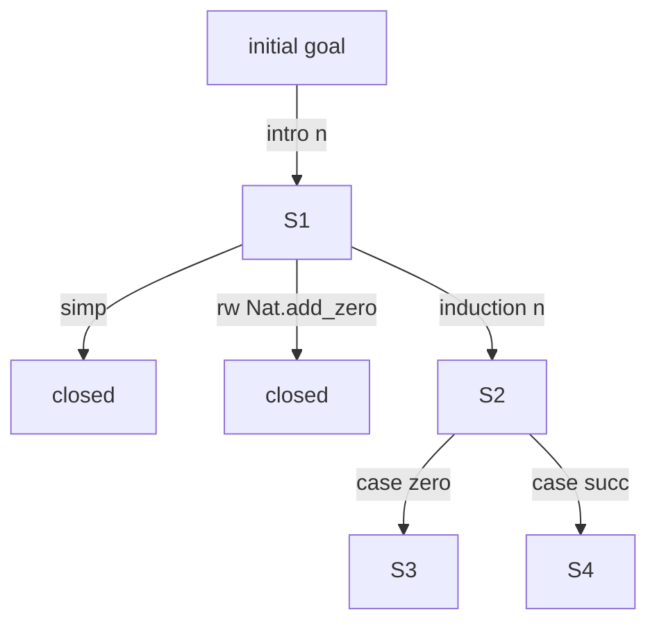

以下では、新しい Lean 的システムを仮に **NPA: Neuro-symbolic Proof Assistant** と呼びます。
狙いは、単に「Leanの再実装」ではなく、**AI時代向けに最初から設計された、証明証明書中心の依存型証明支援系**です。

既存のLeanやRocqから学ぶべき最重要点は、便利な tactic・elaborator・AI・plugin を信用せず、最終的に小さな kernel が proof term を検査するという分離です。Lean公式リファレンスも、Leanのcore type theoryは proof term だけを検査する minimal kernel に実装され、tacticはそのkernelが検査するtermを生成すると説明しています。Rocqも同様に、kernelとelaboration/tacticsを分ける de Bruijn criterion を採っています。([Lean Language][1])

---

# 1. 最終的に作りたいもの

作るべきものは、単体の「証明器」ではなく、次のような総合システムです。

```text
NPA = 論理カーネル
    + 表層言語
    + elaborator
    + tactic言語
    + 自動証明器
    + AI証明探索基盤
    + 数学ライブラリ
    + パッケージ管理
    + proof certificate形式
    + 独立checker
    + sandbox検証基盤
    + IDE / API
```

一言でいうと：

```text
AIが証明を探し、
人間が形式化の意図を確認し、
kernelと独立checkerが証明証明書だけを検査する、
certificate-first な証明支援系。
```

---

# 2. 全体アーキテクチャ

全体は9層に分けます。

```text
┌──────────────────────────────────────────────┐
│ 9. User / IDE / Web UI / API                  │
│    エディタ、goal表示、AI補助、証明説明        │
├──────────────────────────────────────────────┤
│ 8. AI Proof Orchestrator                      │
│    LLM, RAG, search, repair, lemma proposal   │
├──────────────────────────────────────────────┤
│ 7. Automation / Solvers                       │
│    simp, ring, omega, linarith, SMT, ATP      │
├──────────────────────────────────────────────┤
│ 6. Tactic / Metaprogramming                   │
│    intro, apply, rw, induction, custom tactic │
├──────────────────────────────────────────────┤
│ 5. Elaborator / Surface Language              │
│    notation, implicit args, typeclass, holes  │
├──────────────────────────────────────────────┤
│ 4. Core Language                              │
│    明示的依存型項、定義、定理、帰納型          │
├──────────────────────────────────────────────┤
│ 3. Proof Certificate Format                   │
│    canonical AST, universe constraints, hash  │
├──────────────────────────────────────────────┤
│ 2. Trusted Kernel                             │
│    型検査、簡約、帰納型検査、証明検査          │
├──────────────────────────────────────────────┤
│ 1. Independent Checkers / Audit Layer         │
│    別実装checker、sandbox外検査、CI監査        │
└──────────────────────────────────────────────┘
```

上に行くほど便利だが信用しない。
下に行くほど小さく、監査しやすく、信頼する。

---

# 3. 設計原則

## 3.1 AIは絶対に trusted base に入れない

AIの役割はこれです。

```text
- 命題を形式化する候補を作る
- 使えそうな補題を探す
- tactic候補を出す
- 中間補題を提案する
- エラーを読んで修正案を出す
- 証明を短くする
- 人間向け説明を作る
```

しかしAIが出したものはすべて未検証です。

```text
AI output
  ↓
tactic / elaborator
  ↓
core proof term
  ↓
kernel / certificate check
  ↓
verified (normal mode)
  ↓
independent checker(s)
  ↓
verified_high_trust
```

## 3.2 proof script ではなく proof certificate を中心にする

LeanやRocqでは、人間は proof script を書きます。しかし最終的に正しさを保証するのは proof term / proof object です。NPAでは最初から **proof certificate** を第一級オブジェクトにします。

```json
{
  "format": "NPA-CERT-0.1",
  "core_spec": "NPA-Core-0.1",
  "module": "Algebra.Group.Basic",
  "imports": [
    {
      "module": "Algebra.Group.Defs",
      "export_hash": "sha256:...",
      "certificate_hash": "sha256:..."
    }
  ],
  "declarations": [
    {
      "kind": "theorem",
      "name": "Group.mul_inv_cancel",
      "decl_interface_hash": "sha256:...",
      "decl_certificate_hash": "sha256:...",
      "axioms_used": []
    }
  ],
  "export_block": [
    {
      "name": "Group.mul_inv_cancel",
      "decl_interface_hash": "sha256:..."
    }
  ],
  "axiom_report": {
    "module_axioms": [],
    "per_declaration": []
  },
  "hashes": {
    "export_hash": "sha256:...",
    "certificate_hash": "sha256:...",
    "axiom_report_hash": "sha256:..."
  }
}
```

`source_script`、`kernel_version`、`checked_by` などの説明・監査用 metadata は、別の audit view として添付してもよいですが、canonical payload や certificate hash には含めません。

proof script は再生成可能な説明文に近く、certificate が本体です。

## 3.3 小さいkernel、強い周辺層

kernelが担う仕事は最小限にします。

kernelがやること：

```text
- core term の型検査
- 定義展開
- definitional equality の判定
- universe constraint の検査
- inductive type の正当性検査
- recursor / eliminator の生成または検査
- proof certificate の検査
```

kernelがやらないこと：

```text
- tactic実行
- AI呼び出し
- theorem search
- typeclass search
- notation解釈
- SMT実行
- ファイルI/O
- ネットワーク
- pluginロード
- パッケージ解決
```

Rocqの公式文書も、tacticやelaborationをkernelから分離することで、信頼すべき部分を小さなkernelに限定できると説明しています。([Rocq][2])

---

# 4. 論理体系

新しく作るなら、基礎論理は冒険しすぎない方がよいです。推奨は Lean/Rocq に近い、CIC系の依存型理論です。

## 4.1 Sort

```text
Prop      : 証明命題の世界
Type 0    : 小さいデータ型の世界
Type 1
Type 2
...
```

推奨：

```text
- Prop の proof irrelevance は必要なら theorem / optional axiom として扱う
- Type 階層は predicative
- universe polymorphism を持つ
- v0.1 では `imax` により impredicative Prop を採る
```

v0.1 の definitional equality には proof irrelevance conversion を入れません。
これは Phase 0 / core-spec の方針に合わせ、kernel の conversion checker を小さく保つためです。

`Prop` と `Type` を分ける理由は、証明と計算データを区別するためです。

```text
p : Prop
h₁ h₂ : p

h₁ と h₂ は証明としては区別しない。
```

一方、

```text
x y : Nat
```

については、`x` と `y` の違いは計算上重要です。

## 4.2 Core term

core language は明示的で、notationや省略引数を持たない形にします。

```text
Term ::=
  Sort Level
| BVar Index
| Const Name [Level]
| App Term Term
| Lam Name Type Body
| Pi  Name Type Body
| Let Name Type Value Body
```

`Nat`, `Eq`, `List`, constructor, recursor は core term の特殊構文にせず、
環境に登録された `Const` として参照します。source-level `match` は recursor application へ
elaboration され、core term には残しません。

重要なのは、core term に以下を入れないことです。

```text
- notation
- implicit arguments
- typeclass placeholders
- unresolved metavariables
- overloaded symbols
- user syntax macro
- AI annotation
```

kernelは、完全に明示化されたtermだけを検査します。

## 4.3 Definitional equality

証明支援系で最も難しい部分の一つが definitional equality です。

必要な簡約：

```text
β-reduction:
  (fun x => t) a  ↦  t[x := a]

δ-reduction:
  定義済み定数の展開

ι-reduction:
  recursor application の計算規則

ζ-reduction:
  let x := a in t  ↦  t[x := a]

η-reduction:
  v0.1 では入れない。将来採用するなら慎重に限定
```

設計方針：

```text
- kernelのconversion checkerは決定的
- reductionはfuel制限なしでも停止する設計にする
- general recursionはcoreに入れない
- v0.1 の再帰定義は recursor application へ elaboration する
- 一般の recursive definitions は将来、termination certificate つきで受理する
- opaque/transparentを明示管理する
```

## 4.4 帰納型

v0.1 kernel の最小対象：

```text
Nat
Eq
```

標準ライブラリで早期に追加する候補：

```text
Bool
Unit
Empty
Prod
Sigma
Sum
List
```

MVP後に対応：

```text
- mutual inductive
- nested inductive
- indexed inductive
- quotient
- coinductive
```

kernelは inductive declaration に対して以下を検査します。

```text
- strict positivity
- universe consistency
- constructor types
- eliminator生成の正当性
- recursion/induction principle
```

## 4.5 再帰と停止性

core language に一般再帰を入れると、論理が壊れます。

したがって：

```text
- source languageでは再帰関数を書ける
- elaboratorが停止性証明を要求する
- v0.1 では recursor application として kernel に渡す
- well-founded recursion / termination certificate は将来拡張として扱う
```

例：

```text
def add : Nat → Nat → Nat
```

sourceでは自然に書ける。

```lean
add zero     m = m
add (succ n) m = succ (add n m)
```

しかしcoreでは、Natのrecursorを使ったtermに変換されます。

---

# 5. Proof certificate形式

## 5.1 なぜcertificateが必要か

source proof scriptだけでは不十分です。

理由：

```text
- parserやnotationが変わると意味が変わる
- elaboratorのバグで違うtermができる可能性がある
- tacticが将来バージョンで違う挙動をする
- AI生成証明は悪意あるコードを含む可能性がある
- build環境に依存すると再現性が落ちる
```

Leanのproof validation文書も、形式定理文が意図に対応しているか、importされたライブラリが信頼できるか、`sorry`やcustom axiomが混入していないか、sandboxや外部checkerを使う高信頼検査が必要になる場面を説明しています。([Lean Language][3])

## 5.2 Certificateの構造

```text
TrustedCertificatePayload =
  Header
  Imports
  NameTable
  LevelTable
  TermDAG
  Declarations
  ExportBlock
  AxiomReport
  Hashes(export_hash, certificate_hash, axiom_report_hash)

CertificateFile =
  TrustedCertificatePayload
  SourceMap (non-trusted metadata)
```

`SourceMap` や表示用 metadata は certificate file に付けてもよいですが、canonical payload や hash
対象には含めません。

宣言は次の形にします。

```json
{
  "kind": "theorem",
  "name": "Nat.add_zero",
  "universes": [],
  "type": {
    "core": "Pi n : Nat, Eq Nat (add n zero) n",
    "hash": "sha256:..."
  },
  "proof": {
    "core": "Nat.rec ...",
    "hash": "sha256:..."
  },
  "opaque": true,
  "dependencies": ["Nat.rec", "Eq.refl"],
  "axioms_used": [],
  "decl_interface_hash": "sha256:...",
  "decl_certificate_hash": "sha256:..."
}
```

## 5.3 Certificateはcanonicalであるべき

同じ canonical payload は同じ hash にならなければいけません。

そのため：

```text
- de Bruijn index を使う
- 名前はdebug用途に限定
- whitespaceなし
- notationなし
- 暗黙引数なし
- universe constraintsを正規化
- dependency順序を固定
- transparent/opaque情報を明示
```

## 5.4 圧縮certificate

巨大ライブラリではproof termが大きくなるため、圧縮が必要です。

方式：

```text
- subterm sharing
- hash-consing
- local abbreviation
- Prop証明の共有・省略表現
- repeated tactic pattern のmacro化
```

ただし圧縮表現を certificate file に入れる場合、trusted payload としては次のどちらかにします。

```text
安全な方式A:
  canonical payload には展開済みtermだけを保存する

安全な方式B:
  圧縮展開 checker を trusted boundary 内で別途検証する
```

MVPではAを選びます。
proof irrelevance を conversion rule として仮定する圧縮は v0.1 では使いません。
使う場合は、標準ライブラリの theorem または明示的 axiom として axiom report に出します。

---

# 6. Kernel設計

## 6.1 kernel API

kernelの外部APIは非常に小さくします。

```rust
check_module(cert: Certificate) -> CheckResult
check_decl(env: Environment, decl: Declaration) -> CheckResult
infer_type(env: Environment, term: Term) -> Type
is_defeq(env: Environment, t: Term, u: Term) -> Bool
check_inductive(env: Environment, ind: InductiveDecl) -> CheckResult
```

## 6.2 kernel内部構造

```text
Environment
  ├── constants
  ├── inductives
  ├── universe constraints
  ├── transparency table
  └── trusted primitives

Context
  ├── local variables
  ├── local definitions
  └── universe parameters

Reduction Engine
  ├── whnf
  ├── unfold
  ├── reduce_recursors
  └── normalize_for_conversion

Type Checker
  ├── infer
  ├── check
  ├── conversion
  └── universe solver
```

## 6.3 checkerは2実装以上

最初から複数checkerを設計に入れます。

```text
npa-kernel-fast:
  Rust実装。普段の開発用。

npa-checker-ref:
  小さく読みやすい参照実装。遅くてよい。

npa-checker-verified:
  後からNPA自身、Rocq、Leanなどで検証する候補。
```

Leanでも、proofを再検査する `lean4checker` や外部checkerを使う高信頼検査が説明されています。特に悪意あるproofやAI生成proofを扱う場合、sandboxでbuildし、sandbox外でexported proofを検査する方式が推奨されています。([Lean Language][3])

---

# 7. 表層言語

ユーザーが書く言語はcoreよりずっと便利にします。

## 7.1 表層構文

```npa
theorem add_zero (n : Nat) : n + 0 = n := by
  induction n with
  | zero => refl
  | succ n ih => simp [add, ih]
```

この文書の表層例では、読みやすさのため `0` を使うことがあります。
Phase 3 MVP の実入力では、数値リテラルを入れるまでは `Nat.zero` か開いた namespace 内の `zero` と書ければ十分です。
certificate に残るのは `Nat.zero` への canonical `Const` 参照です。

表層言語が持つもの：

```text
- notation
- implicit arguments
- named arguments
- coercion
- typeclass
- pattern matching
- do notation
- calc block
- holes
- tactic block
- namespace
- inductive declaration
- sections
- attributes
```

## 7.2 elaborator

elaboratorは次を行います。

```text
source term
  ↓
parse
  ↓
name resolution
  ↓
notation expansion
  ↓
implicit argument insertion
  ↓
typeclass search
  ↓
metavariable solving
  ↓
termination checking
  ↓
core term generation
```

elaboratorの出力は必ず見えるようにします。

```text
#print surface theorem_name
#print core theorem_name
#print certificate theorem_name
#print axioms theorem_name
#print dependencies theorem_name
```

## 7.3 elaboratorは信用しない

elaboratorがバグっていても、kernelがcore termを検査します。

ただし、elaboratorが「ユーザーが意図しない命題」に変換する可能性はあります。これはkernelでは防げません。

したがって、自然言語や曖昧なnotationを使う場合には、必ず逆翻訳と確認を入れます。

```text
ユーザー入力:
  任意の正数 x について x² > 0

形式化候補:
  ∀ x : ℝ, 0 < x → 0 < x ^ 2

逆翻訳:
  すべての実数 x について、xが0より大きければ、x²は0より大きい。
```

---

# 8. Tactic / Metaprogramming

Leanでは tactic は proof state を変更する命令的プログラムとして説明され、成功すれば新しいsubgoal列を返し、subgoalがゼロなら証明が完了します。また、tacticは背後でproof termを構成し、それがkernelで検査されます。([Lean Language][4])

NPAでも同様にしますが、よりAI向けに構造化します。

## 8.1 Proof state

文字列ではなく構造化データにします。

```json
{
  "state_id": "s_9f32",
  "goals": [
    {
      "goal_id": "g1",
      "context": [
        {
          "name": "n",
          "type_surface": "Nat",
          "type_core_hash": "sha256:..."
        },
        {
          "name": "ih",
          "type_surface": "n + 0 = n",
          "type_core_hash": "sha256:..."
        }
      ],
      "target_surface": "Nat.succ n + 0 = Nat.succ n",
      "target_core_hash": "sha256:...",
      "suggested_actions": ["simp", "rw [ih]", "exact congrArg Nat.succ ih"]
    }
  ]
}
```

## 8.2 Tactic API

```json
{
  "state_id": "s_9f32",
  "tactic": "simp [Nat.add_zero]"
}
```

結果：

```json
{
  "status": "success",
  "new_state_id": "s_a18c",
  "closed_goals": ["g1"],
  "new_goals": [],
  "certificate_delta_hash": "sha256:...",
  "messages": []
}
```

失敗時：

```json
{
  "status": "error",
  "error_kind": "rewrite_failed",
  "message": "rewrite rule Nat.add_zero does not match target",
  "expected_pattern": "?x + 0",
  "target": "0 + n = n",
  "repair_hints": [
    "try `simp`",
    "try `rw [Nat.zero_add]`"
  ]
}
```

## 8.3 tacticの分類

```text
Pure tactic:
  proof stateだけを読み、proof term fragmentを返す。
  原則安全。

Search tactic:
  theorem databaseを検索する。
  timeout必須。

Solver tactic:
  外部solverや内部決定手続きを使う。
  certificate必須。

AI tactic:
  LLMやモデルを呼び出す。
  sandbox + kernel check必須。

Effectful tactic:
  ファイル・ネットワーク・外部プロセスを触る。
  capability permission必須。
```

## 8.4 capability model

tacticやpluginには権限を明示します。

```text
cap.read_environment
cap.search_library
cap.call_solver
cap.call_ai
cap.read_file
cap.write_file
cap.network
cap.spawn_process
```

デフォルトでは：

```text
- read_environment は許可
- search_library は許可
- call_solver は制限つき
- call_ai は制限つき
- file/network/process は禁止
```

Rocqの公式文書は、pluginはRocqの挙動を予期しない形で変え得るため、通常のlibraryより高い信頼が必要であり、`rocqchk`のような検査で信頼問題を軽減できると説明しています。NPAではこの問題を避けるため、pluginをcapability制にし、kernelを変更できない設計にします。([Rocq][5])

---

# 9. 自動化エンジン

NPAの自動化は tactic の集合ではなく、**proof-producing solver 群**として設計します。

## 9.1 標準tactic

最初から入れるべきもの：

```text
intro
exact
apply
refine
constructor
cases
induction
rw
simp
simp_all
assumption
contradiction
exists
specialize
have
calc
```

## 9.2 決定手続き

分野別に proof-producing solver を用意します。

```text
算術:
  omega / presburger
  linarith
  nlinarith
  norm_num

代数:
  ring
  group
  field_simp

命題論理:
  tauto
  aesop系探索
  SAT certificate

等式:
  congruence closure
  e-graph rewrite
```

重要なのは、solverが「答え」だけでなく「証明証明書」を返すことです。

```text
solver says:
  goal is true

では不十分。

solver returns:
  certificate C

kernel/checker verifies:
  C proves goal
```

## 9.3 `simp` の設計

`simp` は証明支援系の実用性を左右します。

`simp` 用メタデータ：

```json
{
  "theorem": "Nat.add_zero",
  "orientation": "left_to_right",
  "priority": 1000,
  "safe": true,
  "terminating": true,
  "tags": ["arithmetic", "nat", "zero"]
}
```

`simp` 実行結果：

```json
{
  "rewrites": [
    {
      "lemma": "Nat.add_zero",
      "position": "target.left",
      "before": "n + 0",
      "after": "n"
    }
  ],
  "certificate_delta": "..."
}
```

AIにもこのログを渡せるようにします。

---

# 10. AI証明探索層

NPAの差別化ポイントはここです。

既存のLeanDojo-v2は、Lean 4向けのAI支援証明器の訓練・評価・デプロイ用フレームワークとして、repository tracing、proof state抽出、RAG、fine-tuning、外部推論API、逐次的proof searchなどを組み合わせています。NPAでは、これを外部フレームワークではなく標準機能として設計します。([Leandojo][6])

## 10.1 AI層の構成

```text
AI Orchestrator
  ├── Formalizer
  │     自然言語 / LaTeX → 形式命題候補
  │
  ├── Premise Retriever
  │     現在goalに関係する定理を検索
  │
  ├── Tactic Policy Model
  │     次のtactic候補を生成
  │
  ├── Value Model
  │     このproof stateが解けそうか評価
  │
  ├── Repair Model
  │     エラーから修正案を生成
  │
  ├── Lemma Proposer
  │     中間補題を提案
  │
  ├── Proof Minimizer
  │     完成証明を短くする
  │
  └── Explanation Model
        検証済み証明を人間向けに説明
```

## 10.2 探索木

AIに1本の証明を出させるのではなく、探索木を作ります。

```text
node = proof state
edge = tactic
terminal = goals = []
```



探索アルゴリズム：

```python
def prove(goal, budget):
    s0 = init_state(goal)
    queue = PriorityQueue()
    queue.push(s0, proof=[], priority=0)

    visited = set()

    while queue and not budget.exceeded():
        state, proof = queue.pop()

        if state.hash in visited:
            continue
        visited.add(state.hash)

        premises = retrieve_premises(state)
        tactic_candidates = generate_tactics(state, premises)
        tactic_candidates += deterministic_tactics(state)
        tactic_candidates = rank(state, tactic_candidates)

        for tac in tactic_candidates:
            result = run_tactic(state, tac)

            if result.success:
                new_proof = proof + [tac]

                if result.closed:
                    cert = assemble_certificate(new_proof)
                    if kernel_check(cert) and independent_check(cert):
                        return VerifiedProof(cert, new_proof)

                queue.push(result.new_state, new_proof, score(result))

            else:
                repairs = repair_tactic(state, tac, result.error)
                queue.push_many(state, proof, repairs)

    return Failure(best_partial=queue.best())
```

## 10.3 スコア関数

```text
score =
  + tactic_policy_score
  + value_model_score
  + premise_match_score
  + goal_simplification_score
  + novelty_bonus
  - proof_length_penalty
  - repeated_state_penalty
  - expensive_tactic_penalty
  - timeout_risk_penalty
```

## 10.4 AIへの入力

AIには単なるテキストではなく、構造化情報を渡します。

```json
{
  "goal": {
    "context": [
      {"name": "n", "type": "Nat"},
      {"name": "ih", "type": "n + 0 = n"}
    ],
    "target": "Nat.succ n + 0 = Nat.succ n"
  },
  "nearby_premises": [
    {
      "name": "Nat.add_zero",
      "type": "∀ n : Nat, n + 0 = n",
      "match_score": 0.98
    },
    {
      "name": "congrArg",
      "type": "..."
    }
  ],
  "failed_tactics": [
    {
      "tactic": "rw [Nat.add_zero]",
      "error": "rewrite rule did not match"
    }
  ],
  "allowed_tactics": [
    "simp",
    "rw",
    "exact",
    "apply",
    "induction"
  ]
}
```

AIの出力：

```json
{
  "candidates": [
    {
      "tactic": "simp [Nat.add_zero]",
      "confidence": 0.93,
      "reason": "target contains addition by zero"
    },
    {
      "tactic": "exact congrArg Nat.succ ih",
      "confidence": 0.75,
      "reason": "induction hypothesis proves inner equality"
    }
  ]
}
```

## 10.5 AIの禁止事項

AIは以下を直接できないようにします。

```text
- theoremをverifiedとして登録する
- axiomを追加する
- kernelを変更する
- unchecked certificateを保存する
- sandbox外ファイルを読む
- package lockを変更する
- trusted libraryを書き換える
```

---

# 11. 前提検索・RAG

数学証明では「どの補題を使うか」が難所です。NPAでは定理検索を標準機能にします。

## 11.1 定理データベース

各定理に次の情報を持たせます。

```json
{
  "name": "Nat.add_zero",
  "namespace": "Nat",
  "statement_surface": "∀ n : Nat, n + 0 = n",
  "statement_core_hash": "sha256:...",
  "domain_tags": ["arithmetic", "nat"],
  "attributes": ["simp"],
  "rewrite": {
    "lhs": "?n + 0",
    "rhs": "?n",
    "orientation": "left_to_right"
  },
  "dependencies": ["Nat.rec", "Eq.refl"],
  "used_by_count": 1823,
  "proof_length": 12,
  "embedding_id": "emb_...",
  "examples": [
    "simp",
    "rw [Nat.add_zero]"
  ]
}
```

## 11.2 検索は4段階

```text
1. lexical search
   名前・文字列一致

2. semantic search
   embeddingによる類似検索

3. type-aware search
   targetにapply/rw/simpaできるか

4. graph-aware reranking
   よく使われる補題、近い依存グラフを優先
```

例：

```text
goal:
  n + 0 = n

検索候補:
  Nat.add_zero
  add_zero
  zero_add
  add_assoc
```

type-aware filter で `Nat.add_zero` が最上位に来ます。

## 11.3 theorem graph

全定理の依存関係グラフを保存します。

```text
Nat.add_comm
  ├── Nat.add_assoc
  ├── Nat.add_zero
  └── Nat.zero_add
```

用途：

```text
- premise selection
- 証明最小化
- ライブラリリファクタリング
- theorem recommendation
- 学習データ作成
- 循環依存検出
```

---

# 12. ライブラリ設計

証明支援系の価値は、最終的には巨大ライブラリで決まります。

## 12.1 ライブラリの構成

```text
Std
  ├── Logic
  ├── Data
  │   ├── Nat
  │   ├── Int
  │   ├── Rat
  │   ├── Real
  │   ├── List
  │   └── Finset
  ├── Algebra
  ├── Order
  ├── Topology
  ├── Analysis
  ├── Measure
  ├── Category
  ├── Computability
  └── Programming
```

## 12.2 命名規則

名前はAI検索にも人間にも重要です。

望ましい名前：

```text
Nat.add_zero
Nat.zero_add
Nat.add_assoc
Nat.mul_comm
Group.mul_inv_cancel
Continuous.comp
Measurable.comp
```

避ける名前：

```text
lemma1
foo
aux2
main_helper
```

## 12.3 属性

定理には属性をつけます。

```text
@[simp]
@[rewrite]
@[intro]
@[elim]
@[congr]
@[norm]
@[safe]
@[unsafe_for_simp]
```

属性は単なる装飾ではなく、自動化とAI検索の重要データにします。

## 12.4 ライブラリCI

CIで検査する項目：

```text
- kernel check
- independent checker check
- axiom report
- no sorry
- no unsafe meta-code in trusted modules
- naming lint
- doc lint
- simp termination lint
- dependency graph diff
- proof certificate hash diff
- performance regression
```

---

# 13. パッケージ管理・ビルド

LeanではLakeが標準build toolで、Leanコードのbuild、外部依存の取得、Reservoirとの統合、testやlinterの実行などを担当します。([Lean Language][7])

NPAでは、この発想をさらに証明向けに拡張します。

## 13.1 パッケージファイル

```toml
[package]
name = "algebra-basic"
version = "1.2.0"
kernel = ">=0.3,<0.4"

[dependencies]
std = "1.2.1"
order = "0.8.0"

[trust]
allow_axioms = ["Classical.choice", "Propext"]
deny_sorry = true
deny_custom_axioms = true
require_independent_checker = true

[build]
sandbox = true
network = false
timeout_seconds = 300
```

## 13.2 lockfile

```json
{
  "package": "algebra-basic",
  "dependencies": [
    {
      "name": "std",
      "version": "1.2.1",
      "source": "registry",
      "content_hash": "sha256:..."
    }
  ],
  "kernel_version": "0.3.2",
  "certificate_format": "NPA-CERT-0.1",
  "checked_at": "2026-05-03T00:00:00Z"
}
```

## 13.3 build成果物

sourceだけでなく、certificateを成果物にします。

```text
_build/
  module.npo        compiled object
  module.npcert     proof certificate
  module.graph.json theorem dependency graph derived from certificate
  module.axioms.json derived axiom report view
  module.trace.json proof state trace
```

---

# 14. セキュリティ設計

AI生成証明や外部パッケージを扱うなら、セキュリティは中核機能です。

## 14.1 sandbox build

すべての非信頼コードはsandbox内で実行します。

```text
- no network
- read-only source directory
- limited temp directory
- CPU制限
- memory制限
- wall-clock制限
- process数制限
- syscall制限
```

## 14.2 trusted challenge / untrusted proof 分離

高信頼モードではこうします。

```text
trusted challenge file:
  theorem statementのみ

untrusted proof file:
  AIや外部ユーザーが生成した証明

validator:
  sandbox内でproofをbuild
  proof certificateをexport
  sandbox外でcertificateを検査
  theorem statementがchallengeと一致することを確認
```

これはLeanのproof validation文書が説明している「trusted challenge」と「possibly malicious proof」を分け、sandbox内でbuildし、外部checkerで検査する考え方と同じ方向です。([Lean Language][3])

## 14.3 audit command

```text
#audit theorem_name
```

出力例：

```json
{
  "theorem": "Nat.add_zero",
  "kernel_checked": true,
  "external_checked": true,
  "contains_sorry": false,
  "custom_axioms": [],
  "standard_axioms": [],
  "unsafe_meta_code": false,
  "imports": [
    {
      "module": "Std.Nat",
      "export_hash": "sha256:...",
      "certificate_hash": "sha256:..."
    }
  ],
  "certificate_hash": "sha256:..."
}
```

---

# 15. IDE / UI

証明支援系はUIが重要です。

## 15.1 IDE表示

```text
左: source code
右上: current goals
右中: local context
右下: AI suggestions
下: messages / errors
```

goal表示：

```text
n : Nat
ih : n + 0 = n
⊢ Nat.succ n + 0 = Nat.succ n
```

AI候補：

```text
1. simp [Nat.add_zero]
   理由: target contains addition by zero.

2. exact congrArg Nat.succ ih
   理由: induction hypothesis proves n + 0 = n.

3. rw [Nat.add_zero]
   理由: rewrite by add_zero may close the goal.
```

## 15.2 core表示

ユーザーがいつでも確認できるようにします。

```text
Show:
  - surface theorem
  - fully elaborated theorem
  - core theorem
  - proof certificate
  - used axioms
  - dependency graph
```

## 15.3 教育モード

AIが証明を埋めるだけでは、ユーザーが学べません。

教育モードでは：

```text
- 次のtactic候補を出す
- なぜ使えるか説明する
- 使用補題を示す
- 証明の自然言語説明を出す
- 代替証明を比較する
```

---

# 16. 外部API設計

## 16.1 `/elaborate`

```json
{
  "source": "theorem add_zero (n : Nat) : n + 0 = n := by ?",
  "mode": "show_core"
}
```

response:

```json
{
  "status": "ok",
  "surface_statement": "∀ n : Nat, n + 0 = n",
  "core_statement_hash": "sha256:...",
  "holes": [
    {
      "hole_id": "h1",
      "goal": {
        "context": [{"name": "n", "type": "Nat"}],
        "target": "n + 0 = n"
      }
    }
  ]
}
```

## 16.2 `/run_tactic`

```json
{
  "state_id": "s1",
  "tactic": "simp"
}
```

response:

```json
{
  "status": "success",
  "closed": true,
  "new_state_id": "s2",
  "certificate_delta": "sha256:..."
}
```

## 16.3 `/prove`

```json
{
  "statement": "theorem add_zero (n : Nat) : n + 0 = n",
  "mode": "normal",
  "timeout_seconds": 60,
  "max_nodes": 10000,
  "allow_ai": true,
  "allow_external_solvers": true,
  "deny_sorry": true,
  "deny_custom_axioms": true
}
```

response:

```json
{
  "status": "verified",
  "proof_script": "by simp",
  "certificate_hash": "sha256:...",
  "checked_by": ["npa-kernel-fast", "npa-checker-ref"],
  "axioms_used": [],
  "search_stats": {
    "nodes": 14,
    "failed_tactics": 8,
    "time_ms": 312
  }
}
```

## 16.4 `/search`

```json
{
  "goal": "n + 0 = n",
  "context": [{"name": "n", "type": "Nat"}],
  "limit": 10
}
```

response:

```json
{
  "results": [
    {
      "name": "Nat.add_zero",
      "statement": "∀ n : Nat, n + 0 = n",
      "score": 0.99,
      "suggested_use": "simpa using Nat.add_zero n"
    }
  ]
}
```

---

# 17. データ保存設計

## 17.1 content-addressed store

termやcertificateはhashで管理します。

```text
TermStore
  hash -> core term

DeclStore
  name -> declaration hash

CertStore
  theorem -> certificate hash

TraceStore
  proof search trace
```

## 17.2 proof search trace

AI学習のために、成功と失敗の両方を保存します。

```json
{
  "theorem": "Nat.add_zero",
  "states": [
    {
      "state_id": "s1",
      "goal": "n + 0 = n",
      "candidates": [
        {"tactic": "simp", "result": "success"},
        {"tactic": "rw [Nat.zero_add]", "result": "failure"}
      ]
    }
  ],
  "final_proof": "by simp",
  "certificate_hash": "sha256:..."
}
```

失敗ログも重要です。

```text
- どのtacticが失敗したか
- なぜ失敗したか
- どのrepairが有効だったか
- どのpremise検索が外れたか
```

これにより、AIモデルを継続的に改善できます。

---

# 18. 自然言語・LaTeX対応

自然言語対応は便利ですが、危険です。kernelは「形式化された命題」が証明されたことしか保証しません。

## 18.1 形式化フロー

```text
自然言語 / LaTeX
  ↓
複数の形式化候補
  ↓
逆翻訳
  ↓
曖昧性表示
  ↓
ユーザー確認
  ↓
証明探索
```

例：

```text
入力:
  任意の正数 x について x² > 0

候補A:
  ∀ x : ℝ, 0 < x → 0 < x ^ 2

候補B:
  ∀ x : ℚ, 0 < x → 0 < x ^ 2

候補C:
  ∀ x : Nat, 0 < x → 0 < x ^ 2
```

UIではこう表示します。

```text
この命題では「正数」の型が曖昧です。
実数 ℝ として解釈しますか？
```

## 18.2 intent certificate

形式証明とは別に、自然言語意図の記録を残します。

```json
{
  "informal_statement": "任意の正数 x について x² > 0",
  "formal_statement": "∀ x : ℝ, 0 < x → 0 < x ^ 2",
  "paraphrase": "すべての実数xについて、xが正ならx²も正",
  "confirmed_by_user": true,
  "confirmation_time": "..."
}
```

これは数学的証明証明書ではありませんが、監査上重要です。

---

# 19. 高信頼モード

NPAには通常モードと高信頼モードを分けます。

## 19.1 通常モード

```text
- source build
- kernel check
- axiom report
- no sorry check
```

## 19.2 高信頼モード

```text
- trusted challenge file
- sandbox build
- certificate export
- sandbox外でcertificate validation
- 複数checkerで再検査
- theorem statement一致確認
- import の export_hash / high-trust 時の certificate_hash 一致確認
- axiom whitelist照合
```

高信頼モードの出力：

```json
{
  "status": "verified_high_trust",
  "theorem_statement_match": true,
  "sandboxed_build": true,
  "kernel_checked": true,
  "external_checked": true,
  "checker_set": [
    "npa-kernel-rust",
    "npa-checker-ref",
    "npa-checker-lean"
  ],
  "axioms_used": [],
  "imports_verified": true
}
```

---

# 20. 実装技術の推奨

## 20.1 kernel

候補：

```text
Rust:
  メモリ安全性、性能、独立checker実装に向く。

OCaml:
  証明支援系文化との相性が良い。

Lean/Rocq:
  verified checkerを書く候補。
```

推奨：

```text
fast kernel:
  Rust

reference checker:
  小さな関数型実装。OCamlまたはHaskellでもよい。

verified checker:
  NPA自身またはLean/Rocqで後から形式検証。
```

## 20.2 表層言語・tactic

```text
NPA自身で書くのが理想。
```

Lean公式リファレンスでも、Leanはtactic、elaborator、build tool、language serverなど多くがLean自身で実装されていると説明されています。NPAでも、kernel以外の多くをNPA自身で書けるようにするのが望ましいです。([Lean Language][1])

## 20.3 AI基盤

```text
Backend:
  Python / Rust / TypeScript

Search:
  Rust or Python

Vector DB:
  pgvector / Qdrant / Milvus

Graph:
  PostgreSQL recursive query or Neo4j

LLM:
  外部APIでもローカルモデルでもよい

Checker:
  CPU worker pool

Proof search:
  Ray / Celery / custom actor system
```

---

# 21. 開発ロードマップ

## Phase 0: 仕様

```text
- core calculusを紙に書く
- typing rules
- conversion rules
- universe rules
- inductive rules
- certificate format
```

成果物：

```text
NPA Core Spec v0.1
```

## Phase 1: 小さいkernel

対応：

```text
- Sort
- Pi
- Lambda
- App
- Let
- Const
- Nat
- Eq
- simple inductive
- βδιζ reduction
```

証明できるもの：

```text
∀ n : Nat, n = n
∀ n : Nat, n + 0 = n
```

## Phase 2: certificate

```text
- canonical core AST
- module certificate
- import の export_hash / certificate_hash
- declaration hash
- axiom report
```

## Phase 3: 表層言語

```text
- parser
- names
- notation
- implicit args
- holes
- simple inductive declaration
- simple elaboration
```

## Phase 4: tactic

```text
- intro
- exact
- apply
- rw
- simp-lite
- induction
```

## Phase 5: IDE/API

```text
- structured proof state
- tactic execution API
- theorem search API
- goal display
```

## Phase 6: library

```text
- Std.Logic
- Std.Nat
- Std.List
- Std.Algebra.Basic
```

## Phase 7: AI探索

```text
- premise retrieval
- tactic generation
- best-first search
- error repair
- proof minimization
```

## Phase 8: independent checker

```text
- reference checker
- external checker
- CI integration
```

## Phase 9: 高度化

```text
- advanced inductive
- quotient
- typeclass
- universe polymorphism強化
- SMT certificates
- theorem graph
- natural language formalization
```

---

# 22. MVPの最小仕様

最初のMVPでは、これだけでよいです。

```text
Core:
  Prop, Type, Pi, Lambda, App, Let, Const, Nat, Eq

Kernel:
  型検査
  definitional equality
  Nat recursor
  simple inductive check

Surface:
  theorem
  def
  by block
  holes

Tactics:
  intro
  exact
  apply
  rw
  simp-lite
  induction

AI:
  現在goalをJSONで渡す
  tactic候補を受け取る
  kernelで検査する

Certificate:
  theorem statement
  proof term
  dependencies
  axioms
  hashes

Security:
  no sorry
  no custom axiom
  sandbox build
```

MVPの成功例：

```npa
theorem add_zero (n : Nat) : n + Nat.zero = n := by
  induction n with
  | zero => refl
  | succ n ih => simp [add, ih]
```

出力：

```json
{
  "status": "verified",
  "certificate_hash": "sha256:...",
  "axioms_used": [],
  "checked_by": ["npa-kernel-fast", "npa-checker-ref"]
}
```

---

# 23. Leanより改善したい点

| 領域                | 改善案                                   |
| ----------------- | ------------------------------------- |
| proof certificate | 第一級オブジェクトとして標準化                       |
| AI連携              | proof state / tactic / error をJSON構造化 |
| 検証                | 独立checkerを最初から標準搭載                    |
| セキュリティ            | sandbox検証を標準モード化                      |
| ライブラリ             | theorem graphとRAG metadataを最初から持つ     |
| 自然言語              | 逆翻訳・確認・intent記録を標準化                   |
| package           | sourceだけでなくcertificate hashをlock      |
| tactic            | capability制で権限管理                      |
| solver            | proof-producing solverのみ高信頼扱い         |
| UI                | core term、axiom、依存グラフを常時可視化           |

---

# 24. 避けるべき設計

```text
- kernelに便利機能を入れすぎる
- AIをtrusted componentにする
- tacticが証明なしでtheoremを登録できる
- external solverの答えをそのまま信じる
- source scriptだけ保存してcertificateを保存しない
- import依存をhash固定しない
- custom notationで定理文の実体が隠れる
- axiom使用を見えなくする
- pluginがkernelやelaboratorを自由に変更できる
- 自然言語形式化をユーザー確認なしで証明済みにする
```

---

# 25. 最終設計の一文要約

新しくLeanのような仕組みを作るなら、望ましい全体像はこれです。

```text
小さな依存型kernelを中心に、
proof certificateを標準成果物にし、
表層言語・tactic・AI・solverはすべて非信頼層に置き、
構造化proof state APIと定理グラフを備え、
sandboxと独立checkerで検証する、
AI-nativeな証明支援プラットフォーム。
```

実装上の最も重要な判断は、次の4つです。

```text
1. kernelを小さくする
2. certificateを中心にする
3. AIを探索器としてだけ使う
4. ライブラリと検索基盤を最初から設計に入れる
```

Leanを参考にするなら、依存型理論・tactic・強力なelaborator・大規模ライブラリという方向は受け継ぐべきです。
ただし新規に作るなら、Leanよりさらに **certificate-first、AI-native、sandboxed、multi-checker、theorem-graph-aware** にするのが望ましいです。

[1]: https://lean-lang.org/doc/reference/latest/ "The Lean Language Reference"
[2]: https://coq.inria.fr/refman/language/core/index.html "Core language — The Rocq Prover 9.2 documentation"
[3]: https://lean-lang.org/doc/reference/latest/ValidatingProofs/ "Validating a Lean Proof"
[4]: https://lean-lang.org/doc/reference/latest/Tactic-Proofs/ "Tactic Proofs"
[5]: https://rocq-prover.org/doc/master/refman/using/libraries/index.html "Libraries and plugins — The Rocq Prover 9.3+alpha documentation"
[6]: https://leandojo.org/leandojo.html "LeanDojo: AI-Assisted Theorem Proving in Lean"
[7]: https://lean-lang.org/doc/reference/latest/Build-Tools-and-Distribution/Lake/ "Lake"
